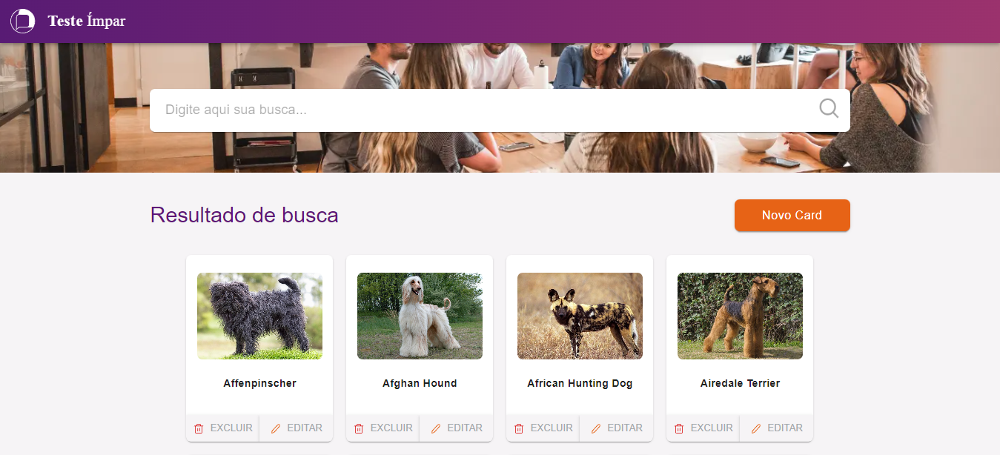
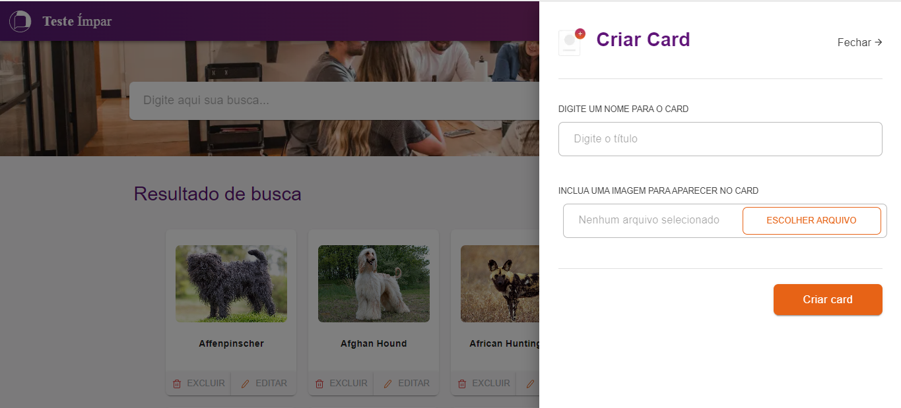
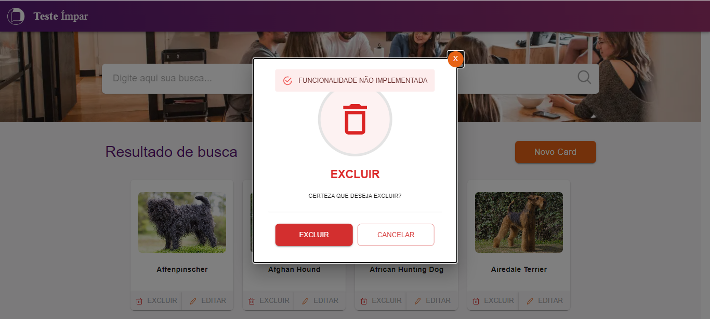

# **Sistema para Busca de Cards de Cachorros** 

## **Descrição** 
Teste técnico Ímpar, aplicação front-end para interação visual com a API TheDogApi. Foram desenvolvidos Cards com imagens e nomes de raças de cachorros, onde por meio de um buscador é possível encontrar os cards digitando o seu nome de forma parcial. O Layout foi pensando de forma responsiva para funcionar em desktops, tablets e mobiles, além de possíveis novas funcionalidas, como criação de um novo card, exclusão e edição do mesmo. 

<hr>

## **Acessar Aplicação**
[Deploy Teste Ímpar](https://teste-impar-4mpm1ga5a-walkerbrum.vercel.app/)

<hr>

## **Objetivos**
Criar aplicação com integração em uma api utilizando bibliotecas para CSS e Javascript;

## **Tecnologias**
Este projeto foi desenvolvido com as seguintes tecnologias: 
- TypeScript;
- Next.js;
- React Hooks;
- Context API;
- Material-UI;

<hr>

## **Requerimentos**
- Node.js;
- npm ou yarn;
- Backend: [https://github.com/oneblueapp/testing_react_js/](https://github.com/oneblueapp/testing_react_js/)

## **Instalação**
`npm install`

## Começando

Primeiro, execute o servidor de desenvolvimento:

```bash
npm run dev
# or
yarn dev
```

Abra [http://localhost:3000](http://localhost:3000) com seu navegador para ver o resultado.

## **Clone do Projeto**
`https://github.com/WalkerBrum/teste-impar.git`

# 📷 Demonstração da Aplicação






## **Autor e Agradecimento**
Eu Walker Lobato como desenvolvedor do projeto sou grato por poder participar desse desafio técnico promovido pela Ímpar, pois foi um grande oportunidade para o desenvolvimento das minhas hard skills, aprimorando os meus conhecimentos na construção de aplicações web.
